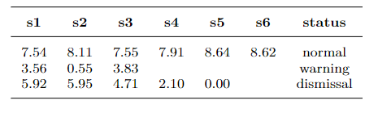

# Academic_Performance_Warning_System_For_Higher_Education

## About

* This is a research project of ours in which we are developing a solution to assist universities in predicting a student's academic probation status, initially based on their academic performance.
* Techniques applied:
> * Feature generation and feature selection techniques.
> * Imbalanced data techniques. 
> * Models: based on Machine Learning Algorithms - Decision Tree, Random Forest, Extra Trees, Gradient Boosting Decision Tree, LightGBM, Support Vector Machine, Logistic Regression, Stochastic Gradient Descent Classifier.
> * Metrics: F2-score, F1-score, recall.

* We do not include data or source code material here for reasons of confidentiality. For more information, please see our full-text report in the attached PDF file: <a href="Academic_Performance_Warning_System_For_Higher_Education .pdf" target="_blank">Report</a> .

## Some Details 
* Dataset: Built two datasets from 4383 students’ information. 
> * Labeling according to the conditions shown in Fig 1.

<i>Fig. 1. Academic probation rules base on academic performance.</i>

> * To get more data for the training process and improve the model performance, we collect the data for each small dataset according to the approach shown in Fig 2.

<i>Fig. 2. Example for data collection of individual students.</i>

> * Data Information:
> > Dataset 1 was designed to be used for developing warning models at the start of the semester and before the final exam. It is made up of 9 distinct tiny datasets designated in the form df(i) for i ∈ {x ∈ N; 2 ≤ x ≤ 10}. Each tiny dataset comprises GPA features from past semesters and aggregated features based on known facts from the semester in need of prediction. 

<i>Fig. 3.Information about Dataset 1.</i>

> > Dataset 2 is recreated to improve the beginning of semester model results. Similar to dataset 1, Dataset 2 consists of 8 small datasets. Details are shown in the Fig 4.

<i>Fig. 4.Information about Dataset 2.</i>

>> For more details on the features of each dataset as well as the formula that generates them, read the report here: <a href="Academic_Performance_Warning_System_For_Higher_Education .pdf" target="_blank">Report</a> .

* Task: In this paper, our goal is to issue warnings to students twice a semester:
>* The first warning: the alert is issued at the beginning of the semester.
>* The second warning: the alert is issued before the final exam.
``
>> `Task 1`: The first warning.
>> >* `Input`:  List GPA of previous semesters.
>> >* `Output`: Alert status (normal, warning, dismissal).
>> > 

<i>Fig. 5.Features used in task 1 for the first warning.</i>

>> `Task 2`: The second warning.
>> >* `Input`: List GPA of previous semesters, list grade and weight of the component examination in the current semester.
>> >* `Output`: Alert status (normal, warning, dismissal).
>> >

<i>Fig. 6.Features used for the second warning.</i>

>> `Task 3`:  The first warning with a improved strategy.
>> >* `Input`: List GPA of previous semesters and pre_avg.
>> >* `Output`:  Alert status (normal, academic probation).
>> >

<i>Fig. 7.Features used in task 3 for the first alerting.</i>

## Experiments
To begin the modeling process, we generate baseline models in order to identify the best optimal algorithm by the average result achieved by each algorithm across the entire set of our tiny datasets. Then, make more intricate adjust based solely on the best optimization algorithm to improve performance. Our experimental procedure is shown in detail in Fig 8.

<i>Fig. 8.Our experimental procedure.</i>

## Results 

<i>Fig. 2.Experimental results on dataset 1 with the first problem.</i>

<i>Fig. 2.Experimental results on dataset 2 with the first problem.</i>

<i>Fig. 2.Experimental results on dataset 1 with the first problem.</i>

